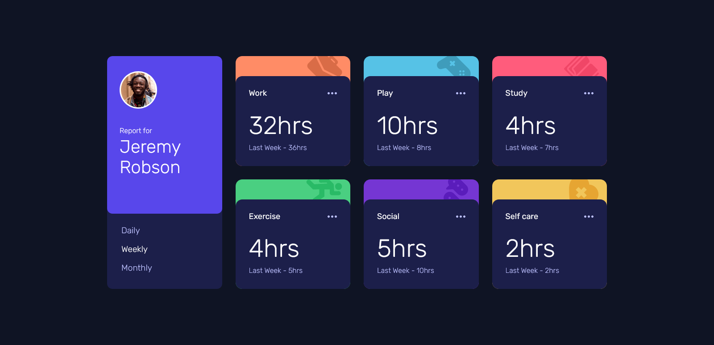

# Time tracking dashboard

This is my solution to the [Time tracking dashboard challenge](https://www.frontendmentor.io/challenges/time-tracking-dashboard-UIQ7167Jw) by [frontendmentors](https://www.frontendmentor.io/home).

## Screenshot

Here is a desktop screenshot of the web page solution that I built.

## Live URL

You can view the deployed version of the solution [here](https://lordseven777.github.io/time-tracking-dashboard--frontendmentors/).

## My thoughts

This was a pretty easy challenge for me and the challenge is also ranked as a **Junior** level one.  
Nonetheless, the challenge got me working mostly on [CSS grids](https://developer.mozilla.org/fr/docs/Web/CSS/CSS_grid_layout).  
Overall, the challenge was fun and it was satisfying to make the HTML version of such a great simple yet well-crafted design alive.

Peace out! 😁👌
